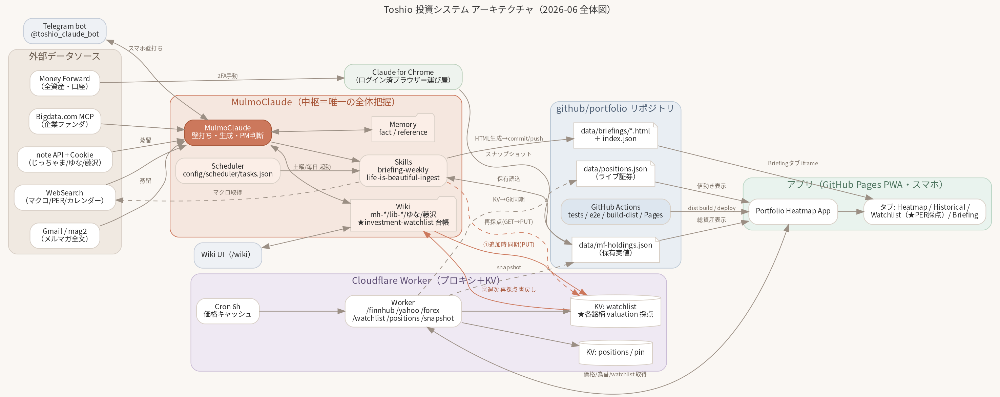
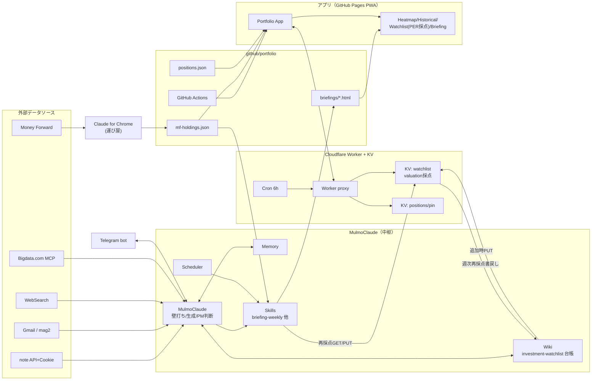

# 投資システム 全体アーキテクチャ図

分散した投資システムの**全体像を1枚にした地図**。中枢（MulmoClaude）が各所をどう繋いでいるかの俯瞰図。
本リポジトリ（portfolioアプリ）が担う部分を含む、運用全体の構成を示す設計文書。

> 運用ロジック・経緯の詳細は [investment-system-architecture.md](./investment-system-architecture.md)（3本柱）を参照。



- ベクター版: [investment-architecture.svg](./assets/investment-architecture.svg)
- 図のソース: [investment-architecture.dot](./assets/investment-architecture.dot)（Graphviz）

### 再生成

```bash
# Noto Sans JP（CJKフォント）が必要。未導入環境では:
#   curl -L -o /tmp/NotoSansJP-Regular.otf \
#     https://cdn.jsdelivr.net/gh/notofonts/noto-cjk@main/Sans/SubsetOTF/JP/NotoSansJP-Regular.otf
#   （/tmp/fonts に置き fontconfig に登録 → fc-cache）
dot -Tpng -Gdpi=150 docs/assets/investment-architecture.dot -o docs/assets/investment-architecture.png
dot -Tsvg            docs/assets/investment-architecture.dot -o docs/assets/investment-architecture.svg
```

---

## 凡例（各コンポーネントと置き場所）

| コンポーネント | 役割 | 置き場所 |
|---|---|---|
| **MulmoClaude** | 中枢。壁打ち・生成・PM判断。全体を把握する唯一の存在 | MulmoClaude アプリ |
| **Wiki** | 知識ベース（mh-*/lib-*/ゆな/藤沢）＋ investment-watchlist 台帳（ウォッチリスト正本） | MulmoClaude `data/wiki/` |
| **Memory** | 恒久メモ（投資哲学・中国スタンス等） | MulmoClaude `conversations/memory/` |
| **Skills** | `briefing-weekly` / `life-is-beautiful-ingest` | MulmoClaude `.claude/skills/`・`data/skills/` |
| **Scheduler** | 定期実行（土曜Briefing・毎日メルマガ取込・コスト） | MulmoClaude `config/scheduler/tasks.json` |
| **Claude for Chrome** | ログイン済ブラウザ＝2FA回避の運び屋（MF・note取得） | 外部ブラウザ |
| **Money Forward** | 全資産・口座の実値 | 外部 |
| **note API + Cookie / Gmail(mag2)** | メンター記事・メルマガ全文の取得 | 外部 |
| **WebSearch / Bigdata.com MCP** | ライブ相場・PER・企業ファンダ | 外部 |
| **mf-holdings.json** | 保有実値（総資産の元） | 本repo `data/` |
| **positions.json** | ライブ証券の値動き | 本repo `data/` |
| **briefings/\*.html + index.json** | 週次Briefing本体 | 本repo `data/briefings/` |
| **GitHub Actions** | tests / e2e / build-dist / Pages deploy | 本repo `.github/workflows/` |
| **Cloudflare Worker** | APIプロキシ＋KV（`/finnhub /yahoo /forex /watchlist /positions /snapshot`） | `worker/` |
| **KV: watchlist** | ウォッチリスト＋各銘柄の `valuation` 採点 | Cloudflare KV |
| **KV: positions / pin** | 保有・PIN認証 | Cloudflare KV |
| **Cron 6h** | 価格キャッシュ | Cloudflare |
| **App（PWA）＋Tabs** | Heatmap / Historical / Watchlist(PER採点) / Briefing | GitHub Pages |
| **Telegram bot** | スマホからの壁打ち窓口 | `@toshio_claude_bot` |
| **Wiki UI** | 閲覧・Lint | MulmoClaude `/wiki` |

## 主要データフロー

1. **取り込み**: Money Forward →（Chrome 運び屋）→ `mf-holdings.json` ／ note・Gmail・WebSearch・Bigdata.com → MulmoClaude → Wiki に蒸留。
2. **ウォッチリスト**: 会話で銘柄追加 → 台帳Wiki → KV同期(PUT)。週次で再採点 → KV＆台帳へ書き戻し。
3. **週次Briefing**: Scheduler(土曜) → `briefing-weekly` スキル →（保有読込＋WebSearch＋ウォッチ再採点）→ HTML生成 → commit/push → アプリ Briefing タブに iframe 配信。
4. **アプリ表示**: App は Worker 経由で価格/為替/watchlist を取得。`mf-holdings`＝総資産、`positions`＝値動き。
5. **CI**: main マージ → build-dist → Pages デプロイ。
6. **窓口**: Telegram → MulmoClaude、Wiki UI → Wiki。

---

## Mermaid ミラー（GitHub等で描画）


